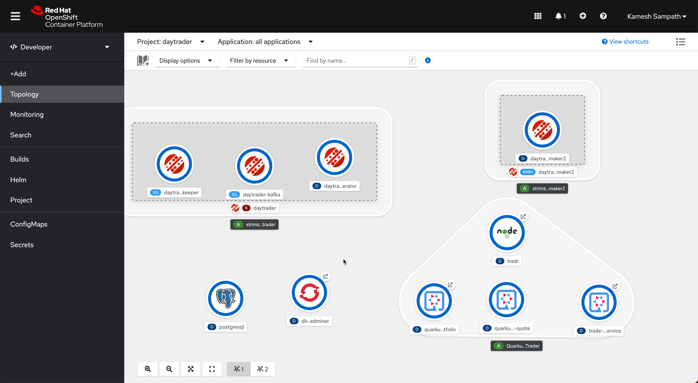

= Quarkus Stock Trader

The https://github.com/IBMStockTrader[IBMStockTrader] application rebuilt with https://quarkus.io[Quarkus].

== Pre-requisites

* https://try.openshift.com[OpenShift4 Cluster]
* https://www.docker.com/products/docker-desktop[Docker for Mac/Windows/Liux]
* https://github.com/mikefarah/yq[yq tool]
* https://kustomize.io/[kustomize]

== Prepare Cluster

Ensure the following operators are installed in cluster:

- https://www.redhat.com/en/resources/amq-streams-datasheet[Red Hat AMQ Streams]
- https://operatorhub.io/operator/keycloak-operator[Keycloak]

[NOTE]: In OpenShift the operators can be installed via Operator Hub integration from Administrator console.

== Clone the sources

[source,bash]
----
git clone https://github.com/kameshsampath/quarkus-stocktrader
----

We will refer to the cloned project sources folder as `$PROJECT_HOME`.

[source,bash]
----
cd $PROJECT_HOME
----

== Deploy Keycloak

[source,bash]
----
oc apply -k k8s/keycloak
----

Because of the limitations with Keycloak Operator, the roles needs to be manually created by login into the Keycloak console.

The following roles need to be created:

- api-admins
- api-users
- admins

Add the `user1` part of the `api-admins`, to enable the user to perform API operations

To retrieve the Keycloak `ADMIN_USERNAME` and `ADMIN_PASSWORD` run the following command:

[source,bash]
----
export ADMIN_USERNAME=$(kubectl get secrets credential-stocktrader-keycloak -oyaml | yq e - '.data.ADMIN_USERNAME' | base64 -d)
export ADMIN_PASSWORD=$(kubectl get secrets credential-stocktrader-keycloak -oyaml | yq e - '.data.ADMIN_PASSWORD' | base64 -d)
----

You can find the Keycloak web console url using the command `oc get -n keycloak routes`.

== Deploy Kafka

[source,shell script]
----
oc apply -k k8s/kafka/prod
----

=== Kafka Mirror Maker

[IMPORTANT]
====
This should be done only on the *target* clusters, i.e. the clusters where the topics/data needs to mirrored, from the Kafka Cluster where sampledaytrader8 is deployed.
====

Copy the link:./k8s/kafka-mirrormaker/daytrader-mirrormaker-example.yaml[$PROJECT_HOME/k8s/kafka-mirrormaker/daytrader-mirrormaker-example.yaml] to `$PROJECT_HOME/k8s/kafka-mirrormaker/daytrader-mirrormaker.yaml`:

[source,bash]
----
cp $PROJECT_HOME/k8s/kafka-mirrormaker/daytrader-mirrormaker-example.yaml  $PROJECT_HOME/k8s/kafka-mirrormaker/daytrader-mirrormaker.yaml
----

Edit and update the `$PROJECT_HOME/k8s/kafka-mirrormaker/daytrader-mirrormaker.yaml` for Kafka cluster external bootstrapserver LoadBalancer IP Address.

The Kafka cluster *bootstrapservers* can be retrieved using the command:

==== Legacy Cluster 

The legacy cluster is identified by alias `daytrader-kafka-legacy` in the file
`$PROJECT_HOME/k8s/kafka-mirrormaker/daytrader-mirrormaker.yaml`, and the bootstrap address found by the following command need to be updated as the value for `daytrader-kafka-legacy.bootstrapServers`:

[source,bash]
----
oc get svc -n daytrader daytrader-kafka-external-bootstrap \
  -ojsonpath='{.status.loadBalancer.ingress[0].ip}'
----

[IMPORTANT]
====
If any of your cluster is on **AWS** then use the following command: 

[source,bash]
----
oc get svc -n daytrader daytrader-kafka-external-bootstrap \
  -ojsonpath='{.status.loadBalancer.ingress[0].hostname}'
----
====

==== Modern App Cluster 

The legacy cluster is identified by alias `daytrader-kafka-modern` in the file
`$PROJECT_HOME/k8s/kafka-mirrormaker/daytrader-mirrormaker.yaml`, and the bootstrap address found by the following command need to be updated as the value for `daytrader-kafka-modern.bootstrapServers`:

[source,bash]
----
oc get svc -n daytrader daytrader-kafka-external-bootstrap \
  -ojsonpath='{.status.loadBalancer.ingress[0].ip}'
----

[IMPORTANT]
====
If any of your cluster is on **AWS** then use the following command: 

[source,bash]
----
oc get svc -n daytrader daytrader-kafka-external-bootstrap \
  -ojsonpath='{.status.loadBalancer.ingress[0].hostname}'
----
====

[source,bash]
----
kustomize build $PROJECT_HOME/k8s/stock-quote/prod | oc apply -f -
----

== Deploy Modules

=== Prepare Database

[source,bash]
----
kustomize build $PROJECT_HOME/k8s/db/prod | oc apply -f -
----

Login to the database admin console using user `traderdb` and password `traderdb` and import the link:.db/schema.sql[schema].

=== API Key

Obtain an API Key from https://iexcloud.io/[IEXCloud], copy the file  link:./k8s/stock-quote/base/api-keys.env.example[ $PROJECT_HOME/k8s/stock-quote/base/api-keys.env.example] to
`$PROJECT_HOME/k8s/stock-quote/base/api-keys.env`:

[source,bash]
----
cp $PROJECT_HOME/k8s/stock-quote/base/api-keys.env.example $PROJECT_HOME/k8s/stock-quote/base/api-keys.env
----

Edit and update the _IEX_API_KEY_ key in the file `$PROJECT_HOME/k8s/stock-quote/base/api-keys.env` to match your API Key.

=== link:./quarkus-stock-quote[StockQuote]
[source,bash]
----
kustomize build $PROJECT_HOME/k8s/stock-quote/prod | oc apply -f -
----

=== link:./quarkus-portfolio[Portfolio]
[source,bash]
----
kustomize build $PROJECT_HOME/k8s/portfolio/prod | oc apply -f -
----

The portfolio deployment will fail to resolve the `Keycloak` url and hence will fail to start.

[source,bash]
----
oc get pods -n daytrader -lapp=quarkus-portfolio
----

The output of the above command should be like:

[source,text]
----
NAME                                 READY   STATUS             RESTARTS   AGE
quarkus-portfolio-7d744cf954-kjf4r   0/1     CrashLoopBackOff   5          5m28s
----

Run the following command to update the deployment:

[source,bash]
----
KEYCLOAK_ROUTE=$(oc get route -n keycloak keycloak -o=jsonpath='{.spec.host}')
oc set env -n daytrader deploy/quarkus-portfolio QUARKUS_OIDC_AUTH_SERVER_URL="https://$KEYCLOAK_ROUTE/auth/realms/stocktrader"
----

And now check the pod to be restarted:

[source,bash]
----
oc get pods -n daytrader -lapp=quarkus-portfolio -w
----

=== link:./trade-orders-service[Trader Orders]
[source,bash]
----
kustomize build $PROJECT_HOME/k8s/trade-orders-service/prod | oc apply -f -
----

=== link:./tradr[Tradr]

[NOTE]
====
The default image registry is `quay.io/kameshsampath`, you can edit $PROJECT_HOME/.env `IMAGE_REPO` variable to change it to match to your settings
====

As `tradr` is a static Single Page Application, it is required to update the environment and rebuild it:

[source,bash]
----
cd $PROJECT_HOME/tradr
envsubst `$PROJECT_HOME/tradr/.env.example` > `$PROJECT_HOME/tradr/.env`
cd ..
make tradr_image_build_push
----

Now update the `$PROJECT_HOME/k8s/tradr/base/deployment.yaml` image to match the tradr image that you rebuilt.

[source,bash]
----
make update_tradr_deployment_image
----

[source,bash]
----
kustomize build $PROJECT_HOME/k8s/tradr/prod | oc apply -f -
----

With all applications successfully deployed, your `daytrader` namespace should look like 

[source,bash]
----
oc get pods -n daytrader
----

Show show an output like:

[source,text]
----
NAME                                                   READY   STATUS    RESTARTS   AGE
daytrader-entity-operator-84687c54c6-5hjnn             3/3     Running   0          67m
daytrader-kafka-0                                      1/1     Running   0          67m
daytrader-kafka-1                                      1/1     Running   0          67m
daytrader-kafka-2                                      1/1     Running   0          67m
daytrader-mirror-maker2-mirrormaker2-5dd869f49-7hhx7   1/1     Running   0          25m
daytrader-zookeeper-0                                  1/1     Running   0          73m
daytrader-zookeeper-1                                  1/1     Running   0          73m
daytrader-zookeeper-2                                  1/1     Running   0          73m
db-adminer-7cfc4bb868-fw9qk                            1/1     Running   0          25m
postgresql-756679bdd5-8xblx                            1/1     Running   0          25m
quarkus-portfolio-7f58764ccf-lblhz                     1/1     Running   0          3m28s
quarkus-stock-quote-86f86bc4d5-wvbrd                   1/1     Running   0          21m
trade-orders-service-64fcb6dd98-27nk6                  1/1     Running   0          17m
tradr-b55bd7dd-n7r5k                                   1/1     Running   0          17m
----

=== Application Routes

NOTE: The application domain may vary according to your deployment

==== Kafka Data Replication App

[source,bash]
----
oc get route trader-orders -n daytrader
----

[source,text]
----
NAME            HOST/PORT                                      PATH   SERVICES               PORT   TERMINATION   WILDCARD
trader-orders   trader-orders-daytrader.apps.gcp.kameshs.dev          trade-orders-service   8080   edge          None
----

==== Modernized UI App

[source,bash]
----
oc get route tradr -n daytrader
----

Should show an output like:

[source,text]
----
NAME    HOST/PORT                              PATH   SERVICES   PORT   TERMINATION   WILDCARD
tradr   tradr-daytrader.apps.gcp.kameshs.dev          tradr      8080   edge          None
----

To be able to login into the application you might need to create the Keycloak client called `tradr`, login to the Keycloak console as did earlier and add a new client called `tradr` under realm `stocktrader` with root URL set to value of `tradr` OpenShift route. 

==  Development 
== Building Application Container Images

[source,bash]
----
make all
----